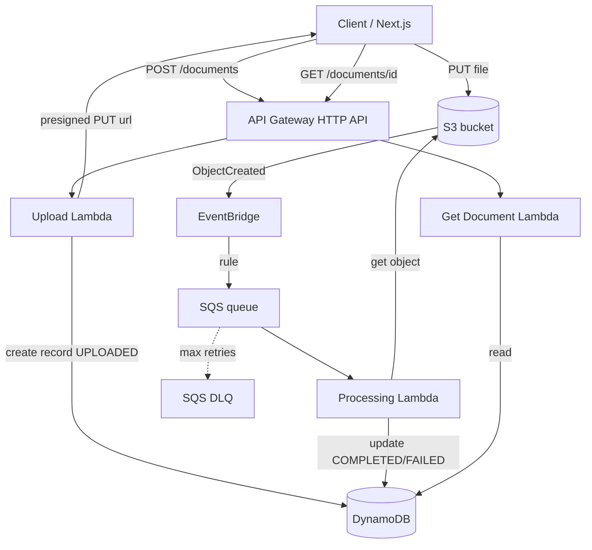

# Hermes

> A production-grade, serverless document-processing platform on AWS.

Hermes lets users upload documents that are processed asynchronously through an
event-driven AWS architecture: text is extracted and metadata, keywords, and a
summary are generated. The processing itself is pluggable and starts out
simulated — the focus is cloud architecture and software-engineering quality, not
the document analysis.

> Status: in active development. This README describes the target system; see the
> [roadmap](./docs/roadmap/) for what is built and what is next.

## Why this project exists

Hermes is built to demonstrate production-minded engineering across:

- Node.js and TypeScript (strict)
- AWS serverless (Lambda, API Gateway, S3, DynamoDB, EventBridge, SQS)
- Event-driven architecture
- Infrastructure as Code with Terraform
- CI/CD with GitHub Actions
- Testing (unit + integration) and observability

## Architecture



Full details: [docs/architecture.md](./docs/architecture.md).

## Tech stack

| Area      | Choice                                                    |
| --------- | --------------------------------------------------------- |
| Language  | TypeScript (strict)                                       |
| Monorepo  | pnpm workspaces + Turborepo                               |
| Compute   | AWS Lambda (Node.js 22), Middy, Zod                       |
| Toolkit   | AWS Lambda Powertools (Logger/Metrics/Tracer/Idempotency) |
| Data      | DynamoDB (single-table-light), S3                         |
| Eventing  | EventBridge + SQS (+ DLQ)                                 |
| IaC       | Terraform                                                 |
| Local dev | Docker Compose + LocalStack                               |
| Testing   | Vitest (+ `aws-sdk-client-mock`, LocalStack)              |
| CI/CD     | GitHub Actions                                            |
| Frontend  | Next.js + Tailwind + React Query (later)                  |

## Local setup

> Prerequisites: Node.js 22+, pnpm, Docker.
> Terraform is needed from Phase 1 onward.

```bash
# Clone and install
git clone git@github.com:jusst-me/Hermes.git
cd Hermes
pnpm install

# Set up LocalStack auth (free account required since March 2026)
cp .env.example .env       # then add your token from https://app.localstack.cloud
docker compose up -d
docker compose ps          # should show localstack as "healthy"

# Run quality checks
pnpm lint                  # ESLint
pnpm format:check          # Prettier
pnpm turbo run typecheck   # TypeScript strict
pnpm test                  # Vitest

# (Phase 1+) Provision local infrastructure
# cd infrastructure/terraform/environments/local
# terraform init && terraform apply
```

Detailed steps are added per phase in [docs/roadmap/](./docs/roadmap/).

## Terraform deployment

Infrastructure is managed entirely with Terraform, with a `local` environment
(LocalStack) and a `dev` environment (real AWS). Real-AWS deployment runs through
CI/CD on the main branch. See [docs/roadmap/phase-6-cicd-real-aws.md](./docs/roadmap/phase-6-cicd-real-aws.md).

## Why these AWS services (trade-offs)

- **Lambda over ECS/Fargate** — scales to zero, pay-per-use, forces good
  event-driven design. ([ADR-0001](./docs/adr/0001-use-serverless-architecture.md))
- **DynamoDB** — managed, fast key-value access modelled around access patterns.
  ([ADR-0003](./docs/adr/0003-dynamodb-data-model.md))
- **EventBridge + SQS** — decoupling, buffering, retries, and a DLQ.
  ([ADR-0004](./docs/adr/0004-eventbridge-sqs-pipeline.md))
- **Terraform** — industry-standard, cloud-agnostic IaC.
  ([ADR-0006](./docs/adr/0006-terraform-for-iac.md))

All decisions: [docs/adr/](./docs/adr/).

## Documentation

- [Architecture](./docs/architecture.md)
- [Technical requirements & quality bar](./docs/technical-requirements.md)
- [Features](./docs/features.md)
- [Architecture Decision Records](./docs/adr/)
- [Roadmap](./docs/roadmap/)
- [Contributing](./CONTRIBUTING.md)

## Future extensions

- Cognito authentication
- OpenSearch for searchable results
- Real AI document analysis (drop-in `DocumentProcessor`)
- Multi-tenant support
