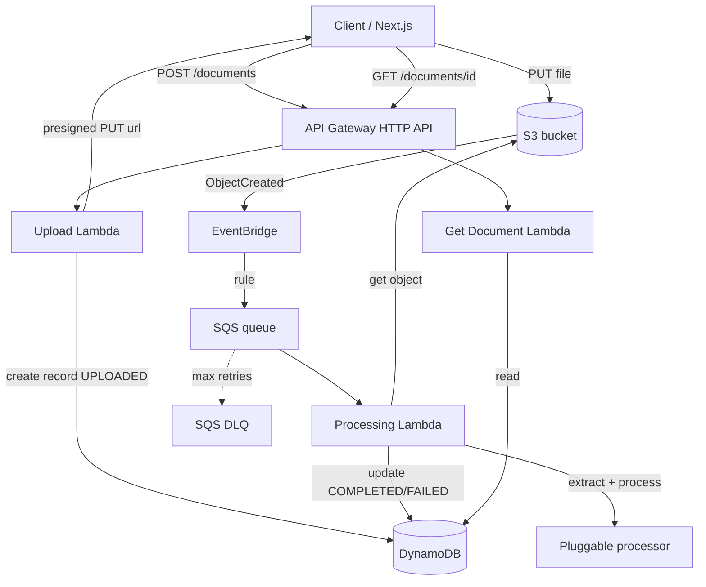
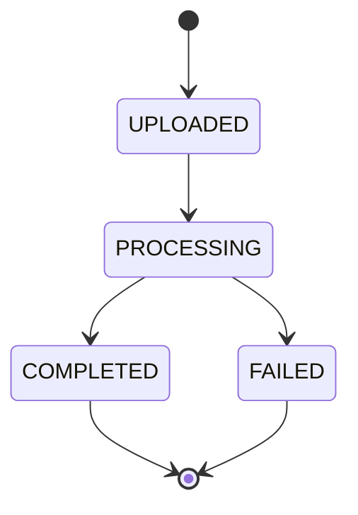
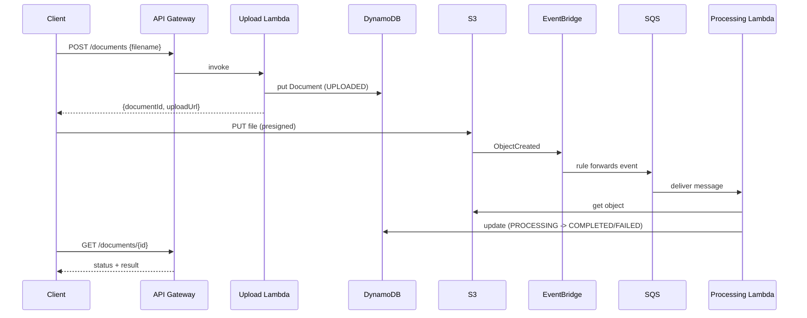

# Hermes — Architecture

> Hermes is a production-grade, serverless document-processing platform. This
> document describes the system goal, the high-level and detailed architecture,
> the data and event flow, the document state machine, and the repository
> structure.

## 1. Goal

Hermes lets users upload documents that are then processed asynchronously through
an event-driven AWS architecture. Processing extracts text and produces metadata
and a summary. The emphasis of the project is **cloud architecture and software
engineering quality**, not the document analysis itself (the processor is
pluggable and starts out simulated).

The project doubles as a learning vehicle: the author is a senior
React/Next.js/TypeScript engineer learning AWS, serverless, Terraform, and
event-driven design. See [roadmap/](./roadmap/) for the phased learning path.

## 2. High-level architecture



## 3. Components

### API Gateway (HTTP API)

The public entry point. Routes:

- `POST /documents` — request an upload (returns a document id and a presigned URL)
- `GET /documents/{id}` — read status and result
- `GET /documents` — list documents (optional / stretch)

### Upload Lambda (`create-upload-url`)

1. Validates the request body with Zod.
2. Creates a `Document` record in DynamoDB with status `UPLOADED`.
3. Generates a presigned S3 `PUT` URL scoped to a single object key.
4. Returns `{ documentId, uploadUrl }`.

The Lambda never receives the file bytes — the client uploads directly to S3 via
the presigned URL. This keeps Lambda fast and cheap and avoids API Gateway
payload limits.

### S3 → EventBridge → SQS

When the client finishes the `PUT`, S3 emits an `ObjectCreated` event to
EventBridge. An EventBridge rule forwards matching events to an SQS queue, which
buffers work for the Processing Lambda. See
[ADR-0009](./adr/0009-s3-eventbridge-trigger-flow.md) for why the trigger is
event-driven from S3 rather than published by the Upload Lambda.

### Processing Lambda (`process-document`)

Triggered by SQS. For each message:

1. Reads the object from S3.
2. Extracts text (PDF) and runs the pluggable `DocumentProcessor` (simulated
   summary, metadata, keywords).
3. Updates the `Document` record to `PROCESSING`, then `COMPLETED` (or `FAILED`).

Reliability is built in: SQS provides retries, a Dead Letter Queue isolates
poison messages, and idempotency (conditional writes + the Powertools Idempotency
utility) makes re-delivery safe. See
[ADR-0005](./adr/0005-dlq-and-idempotency.md).

### Get Document Lambda (`get-document`)

Reads a `Document` by id from DynamoDB and returns its status and result.

### S3, DynamoDB, EventBridge, SQS, CloudWatch

- **S3** — private bucket for uploaded documents and any exports.
- **DynamoDB** — document metadata and results (single-table-light, see below).
- **EventBridge** — decouples producers and consumers.
- **SQS** — buffer with retries, backpressure, and a DLQ.
- **CloudWatch** — structured logs, metrics, dashboards, and alarms.

## 4. Layered / hexagonal design (not MVC)

Each Lambda follows a layered structure:

```text
handler (adapter)      -> translates the AWS event (HTTP/SQS/S3), validates (Zod), logs
  service (domain)     -> business logic / use-case, no AWS details
    repository         -> data access (DynamoDB, S3) behind an interface
    processor          -> pluggable document processing behind an interface
```

MVC is intentionally avoided: the backend has no View layer (the view is the
separate Next.js frontend) and triggers are heterogeneous (HTTP, SQS, S3
events), not only HTTP. The layered/ports-and-adapters approach gives
testability (mock repositories/processors) and swappability (LocalStack ↔ AWS,
simulated ↔ real AI). See
[ADR-0002](./adr/0002-layered-hexagonal-architecture.md).

## 5. Data model (DynamoDB, single-table-light)

A single table holds documents, designed to evolve without migration.

- Partition key `PK` = `documentId`
- Sort key `SK` (reserved for future related items, e.g. `RESULT#v1`)
- One GSI for `list documents` / `by status` (e.g. `GSI1PK = status`,
  `GSI1SK = uploadedAt`)

Example item:

```json
{
  "PK": "doc-123",
  "SK": "META",
  "documentId": "doc-123",
  "filename": "invoice.pdf",
  "status": "UPLOADED",
  "uploadedAt": "2026-06-12T21:00:00.000Z",
  "result": null
}
```

Rationale and the trade-off versus multi-table and full single-table design are
in [ADR-0003](./adr/0003-dynamodb-data-model.md).

## 6. Document state machine



Transitions are enforced with DynamoDB conditional writes, so a re-delivered SQS
message cannot reprocess a document that is already `COMPLETED`.

## 7. Event flow (sequence)



## 8. Repository structure

```text
hermes/
├── apps/
│   ├── api/
│   │   ├── src/
│   │   │   ├── functions/{create-upload-url,process-document,get-document}/
│   │   │   ├── services/        # domain logic
│   │   │   ├── repositories/    # DynamoDB/S3 access
│   │   │   ├── events/          # event contracts + publishing
│   │   │   ├── processors/      # pluggable DocumentProcessor
│   │   │   ├── schemas/         # Zod schemas
│   │   │   └── shared/          # logger/powertools, middleware, errors
│   │   └── tests/{unit,integration}/
│   └── web/                     # Next.js (later phase)
├── packages/core/               # shared types/contracts (Document, events)
├── infrastructure/terraform/
│   ├── modules/{storage,database,api,events,observability}/
│   └── environments/{local,dev}/
├── docs/{architecture.md,technical-requirements.md,features.md}
│   ├── adr/                     # architecture decision records
│   └── roadmap/                 # the step-by-step learning path
├── .cursor/rules/
├── .github/workflows/
├── docker-compose.yml           # LocalStack
├── pnpm-workspace.yaml
├── turbo.json
├── package.json
└── README.md
```

## 9. Related documents

- [technical-requirements.md](./technical-requirements.md) — stack and quality bar
- [features.md](./features.md) — feature catalog with acceptance criteria
- [adr/](./adr/) — architecture decision records
- [roadmap/](./roadmap/) — phased learning path
